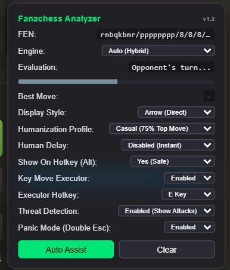
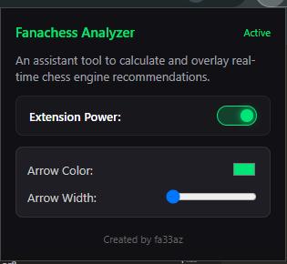

# Fanachess Analyzer

Note: this project was developed for learning purposes, I do not condone or encourage cheating in games and this project should help you get better at chess. Non fair play might result in your chess.com account being suspended if you do not use wisely.

---

Fanachess Analyzer is a Chrome Extension designed to analyze chess board positions and display live evaluation hints directly on Chess.com. It acts as an interactive analysis assistant to calculate and overlay real-time chess engine recommendations.

---

## Interface Preview

### Live Move Suggestions Overlay (Hold `Alt`)
You can hold down the **Alt** key on your keyboard to instantly display the glowing analysis overlay arrow on the board showing the engine's recommended best move.

---

### Control Panel & Popup Settings

| In-Game HUD Control Panel | Extension Settings Popup |
|---|---|
|  |  |

---

## Key Features

* **Multiple Engine Integrations**: Supports routing calculations through Lichess Cloud, ChessDB, Maia chess neural networks, and Stockfish Live. It automatically falls back to an alternative engine if the primary choice fails.
* **Opening Book Explorer**: Queries the Lichess Masters database to show real-time opening theory, ECO codes, and statistics of top grandmaster moves.
* **Visual Evaluation Bar**: Features a clean horizontal bar under the evaluation text that dynamically shifts width and color gradients based on which player holds the advantage.
* **Simulated Human Behaviors**: 
  * Calculates randomized thinking delays based on a log-normal distribution.
  * Adds hesitation intervals during complex captures and check escapes.
  * Dynamically reduces move accuracy when winning by a large margin to prevent profile flagging.
  * Drag-and-drop actions simulate natural cursor curves (Bezier curves) with micro-jitter and variable speeds.
* **Panic Toggle**: Pressing the Escape key twice immediately unloads the HUD, canvas elements, and disconnects DOM observers. Pressing it twice again restores the interface.
* **Quick Hide**: Pressing the backtick key toggles the visibility of the control panel on and off without stopping the active overlay calculations.
* **Isolation**: All components are rendered inside a closed Shadow DOM container to isolate the extension's code structure from detection scripts.
* **Toolbar Power Control**: Includes a simple master switch in the extension pop-up menu to enable or disable the tool globally.

---

## How to Install and Use

### Step 1: Download the Package
Download the compiled release package named `fanachess.zip` from this repository. Extract the archive into a dedicated folder on your computer.

### Step 2: Install the Extension in Chrome
1. Open Google Chrome and go to `chrome://extensions/`.
2. Enable the **Developer mode** toggle in the top-right corner.
3. Click the **Load unpacked** button in the top-left corner.
4. Browse to and select the extracted folder containing the `manifest.json` file.

### Step 3: Run the Analyzer
1. Navigate to a chess game on Chess.com.
2. Hold down the **Alt** key to show the best move suggestion arrow on the board.
3. Press the **backtick key** (located below Esc) to toggle the visibility of the settings panel.
4. Press the configured hotkey (Spacebar, Q, F, or E) to execute the suggested move using the mouse drag simulation.
